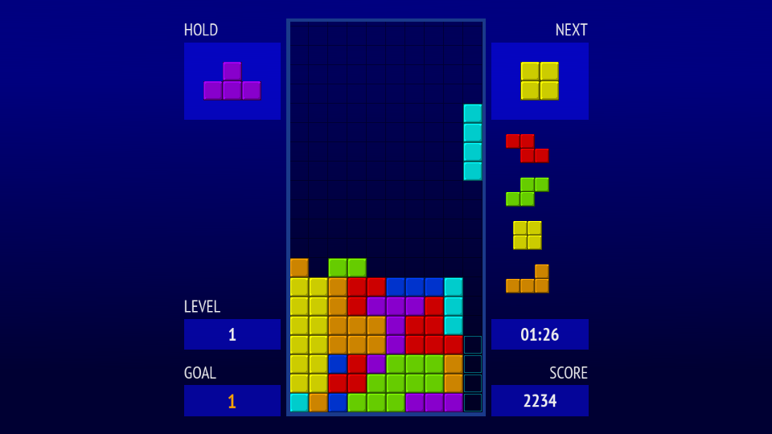

OpenBlok
========

[](https://travis-ci.org/mmatyas/openblok)
[](https://ci.appveyor.com/project/mmatyas/openblok)
[](https://scan.coverity.com/projects/mmatyas-openblok)

A customizable, cross platform, open-source falling block game, packed with a bunch of features.



**Features:**

- [x] Ghost piece support
- [x] Hold piece support
- [x] Customizable next pieces support
- [x] Customizable DAS support
- [x] SRS, TGM and Classic rotation
- [x] Full wall- and floor kick support
- [x] 7-piece bag random generator
- [x] Classic, Extended and Infinity lock support
- [x] Sonic drop and Zangi-move support
- [x] T-Spin and Mini T-Spin support
- [x] Combo support
- [x] Battle mode, Sprint and Ultra
- [x] Proper menu, configuration and stats
- [x] Gamepad support
- [x] Music and sound effects
- [x] Big screen, small screen support
- [x] Runs on most desktop systems
- [x] Runs on embedded Linux, even without X11
- [x] Runs in browsers (experimental)


Download
--------

See the [Releases](https://github.com/mmatyas/openblok/releases) page to download the latest version.

On Debian/*buntu, you can also install the game from a PPA:

```sh
sudo add-apt-repository https://dl.bintray.com/mmatyas/deb
sudo apt-get update
sudo apt-get install openblok
```


Dependencies
------------

- CMake (at least 2.8, 3.1+ recommended)
- C++14 supporting compiler (GCC 4.9 or better)
- SDL2, SDL2_image, SDL2_mixer, SDL2_ttf
- gcov, lcov (only for generating test coverage report)

Eg. on Debian: `sudo apt install cmake libsdl2-dev libsdl2-image-dev libsdl2-mixer-dev libsdl2-ttf-dev`

or on Fedora/RPM: `sudo dnf install cmake SDL2-devel SDL2_image-devel SDL2_mixer-devel SDL2_ttf-devel`


Build
-----

```sh
mkdir build && cd build
cmake ..
make
./src/openblok --data ../data
```

**Optional build parameters:**

- `CMAKE_BUILD_TYPE`: By default, the game builds without optimizations or debug symbols. To create an **optimized release build**, set this to `Release`. To create a **debug build**, set this value to `Debug`. Using certain IDEs, eg. Visual Studio, this setting has no effect, as you have to set the build type inside these programs instead. See the CMake documentation for more details.
- `INSTALL_PORTABLE`: The game needs to know where it can find the data files. By default, the game is searching for them in the absolute path of the installation location, which is usually `/usr/local/share/openblok` on Linux. By setting `INSTALL_PORTABLE` to `ON`, the game will search for the files in a `data` directory located next to the binary. Default: `OFF`. Recommended: `OFF` on Linux, `ON` on Windows.
- `CMAKE_INSTALL_PREFIX`: The base directory of the installation step (eg. `make install`). Defaults to `/usr/local` or `C:\Program Files`. See the CMake documentation for more details.
- `BUILD_TESTS`: Builds the test suite. You can run them by calling `./build/tests/openblok_test`. Debug build only, default: `ON`.
- `BUILD_COVERAGE`: Allows building the test coverage report. Requires `BUILD_TESTS` and `gcov`/`lcov`. Default: `OFF`.

**Additional build targets**

- `make coverage`: Builds the test coverage report
- `make install/strip`: Installs the game on your system
- `make package`: Creates `tar.gz` and Debian `deb` packages


Notes
-----

**Runtime arguments**

You can change certain game parameters, eg. the location of the data directory. Run the game with the `--help` flag to see the available options.

**Hardware acceleration on ARM Linux**

Using the default SDL2 library shipped with Debian/Raspian, hardware acceleration may not work properly, causing slowness and ugly graphics. For the best performance, it is recommended to build your own SDL2, as described [here](https://github.com/mmatyas/openblok/wiki/Custom-SDL2-build-for-ARM). With hardware acceleration, OpenBlok runs full speed even on a first-gen Raspberry Pi.
